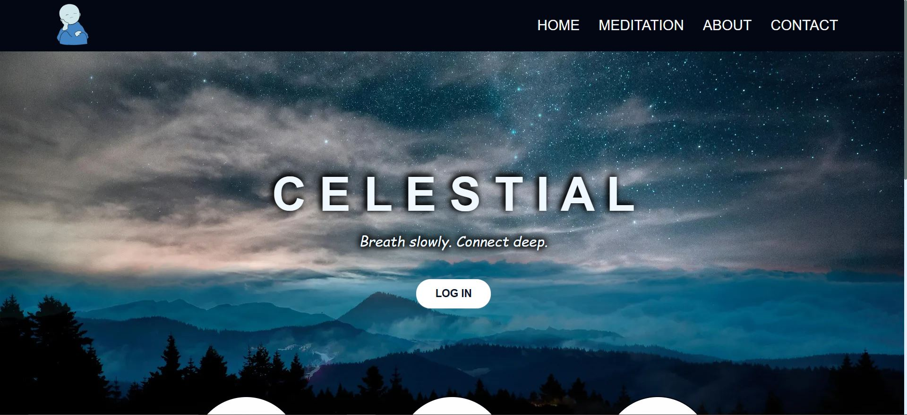

<div align='center'>
    
        <h1>Celestial | React Project - Arianna Pesce</h1>   
</div>

<div align='center'>
<p>
  <a href="#description">Description</a> •
  <a href="#installation-&-Configuration">Installation & Configuration</a> •
    <a href="#technologies-Used">Technologies Used</a> •
  <a href="#contact">Contact</a>
</p>
</div>



<br>

# 🌌 Celestial | React Project - Arianna Pesce

--> [Visit the site](https://celestial-b4bee.web.app)

## Description  

**Celestial** is a web application developed with **React**, designed to guide users through moments of meditation and mindful breaks. The project offers a simple, accessible, and responsive interface that allows users to customize their meditation sessions.

## ✨ Main Features
🧘 Customizable timer: easily set the duration of your meditation.
⏸️ Full timer control: pause and resume your session at any time.
📱 Responsive design: accessible and enjoyable on any device.
🧭 Smooth user experience: minimal and intuitive interface designed to support focus and calm.
🧩 Organized code structure: clear, modular components that are easy to extend.

---  

## Installation & Configuration

1. Prerequisites
  Make sure you have the following tools installed on your computer:

  - **A modern browser** (Google Chrome, Mozilla Firefox, etc.)
  - **Git** (if you want to clone the repository)
  - **A code editor** (Visual Studio Code, Sublime Text, etc.) to edit the files

2. **Clone the repository**:
  You can clone the project to your computer using Git. Open the terminal and type the following command:

  ```bash
  git clone https://github.com/ariannapesce/repository-name.git

This is a project developed with CodePen, the HTML&CSS code is only decorative, you MUST eliminate if you don't have intention to use it, on the other hand you MUST connect the file each others.

---  

## Technologies Used  
 
- [React](https://reactjs.org/)
- HTML5 / CSS3
- JavaScript (ES6+)

---  

## Contact

> GitHub [@pescearianna](https://github.com/pescearianna) &nbsp;&middot;&nbsp;
> LinkedIn [Arianna Pesce](https://www.linkedin.com/in/ariannapesce/)

---
